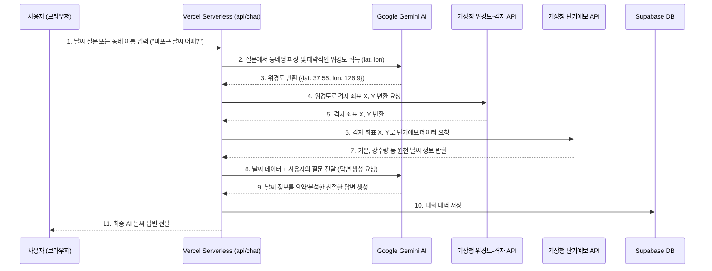

# 01_weather_ai_app_plan.md

이 문서는 제미나이(Gemini) AI와 기상청 단기예보 API를 연동하여 실시간 날씨 정보를 분석하고 답변을 제공하는 초간단 웹 애플리케이션의 구현 계획을 정의합니다.

## 1. 개요 및 목표
* **목표**: 사용자가 동네 이름(예: 서울시 마포구 합정동)이나 날씨 질문을 입력하면, AI가 자동으로 기상청 API를 통해 실시간 날씨를 조회하고, 그 실시간 데이터를 기반으로 날씨에 최적화된 친근한 답변을 제공합니다.
* **배포**: Vercel을 통한 호스팅 및 서버리스 함수(Serverless Functions) 활용.
* **데이터베이스**: Supabase를 사용하여 대화 내역(`chat_history`)을 누적하여 기록.
* **보안 및 제한**: 사용자가 제공한 API Key와 인증 정보는 Vercel 환경 변수로 관리하여 유출을 차단하며, 토큰을 아끼기 위해 가장 최소한의 코드와 직관적인 아키텍처로 구현합니다.

---

## 2. 시스템 아키텍처 및 흐름


---

## 3. 디렉토리 구조 (Directory Structure)
토큰 소모를 최소화하기 위해 복잡한 프레임워크 대신, Vercel의 정적 호스팅 및 Node.js 서버리스 API 구조를 채택합니다.
```
날씨AI/
├── index.html            # 프론트엔드 메인 UI (HTML5)
├── style.css             # 모던 다크모드/글래스모피즘 CSS 스타일시트
├── script.js             # UI 상호작용 및 API 호출 프론트엔드 스크립트
├── vercel.json           # Vercel 빌드 및 배포 설정
├── package.json          # Node.js 패키지 설정 (API 의존성 정의)
├── .env.example          # 환경 변수 템플릿
├── api/
│   └── chat.js           # [백엔드] Gemini + 기상청 API + Supabase 연동 서버리스 함수
├── docs/
│   └── plans/
│       └── 01_weather_ai_app_plan.md  # [본 문서]
└── supabase/
    └── migrations/
        └── 001_create_chat_history_table.sql  # Supabase 마이그레이션 SQL
```

---

## 4. 상세 구현 계획

### 4.1 Supabase 데이터베이스 설정
* **테이블**: `chat_history`
  * `id`: `uuid` (기본키)
  * `created_at`: `timestamptz` (생성일시)
  * `user_message`: `text` (사용자 입력)
  * `ai_response`: `text` (AI 최종 답변)
  * `location`: `text` (인식된 위치 정보)
  * `weather_raw_data`: `jsonb` (기상청에서 받아온 날씨 원천 데이터 백업)

### 4.2 백엔드 API (`api/chat.js`)
1. **위치 파싱 및 Geocoding**:
   * Gemini API에 사용자의 입력 메시지를 보내, "이 질문에서 찾고자 하는 한국의 동네 이름과 그 지역의 대표 위도(lat), 경도(lon)를 찾아 JSON(`{location, lat, lon}`) 형식으로만 대답해줘" 라고 1차 호출을 수행합니다.
2. **기상청 격자 변환**:
   * 획득한 `lat`, `lon`을 가지고 기상청 API인 `nph-dfs_xy_lonlat`를 호출하여 격자 `x`, `y` 좌표를 얻습니다.
3. **단기예보 조회**:
   * 얻어낸 `x`, `y`와 현재 날짜/시간 정보를 조합하여 `nph-dfs_shrt_grd` API를 호출합니다.
   * 기상청 API가 리턴하는 날씨 정보를 필요한 부분만 가공합니다.
4. **Gemini 날씨 맞춤 답변 생성**:
   * 정제한 실시간 날씨 데이터(기온, 강수 형태 등)와 사용자의 원래 메시지를 Gemini API에 전달하여, "제시된 날씨 정보를 기반으로 사용자의 질문에 한국어로 친절히 대답해줘"라고 요청합니다.
5. **Supabase 저장 및 응답**:
   * 대화 내역을 Supabase에 저장한 후 프론트엔드로 최종 답변을 응답합니다.

### 4.3 프론트엔드 UI
* 깔끔한 다크 테마 및 유리 효과(Glassmorphism)를 적용한 깔끔하고 미니멀한 대화창을 구현합니다.
* 사용자가 질문을 입력하고 '전송' 버튼을 누르면 말풍선 형태로 질문과 AI의 답변이 추가됩니다.

---

## 5. 검증 및 테스트 계획
* **API 호출 검증**: 로컬 개발 환경에서 Vercel CLI (`vercel dev`)를 실행하여 `api/chat` 엔드포인트의 동작을 확인합니다.
* **UI 시각적 확인**: 기상 정보가 정상적으로 표시되는지 브라우저에서 직접 테스트합니다.
* **Supabase 연동 확인**: Supabase 대시보드에서 대화 내역이 정상적으로 insert되는지 확인합니다.
